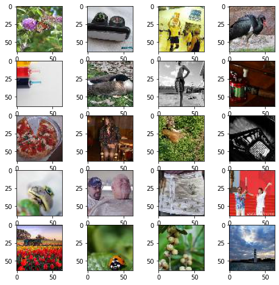
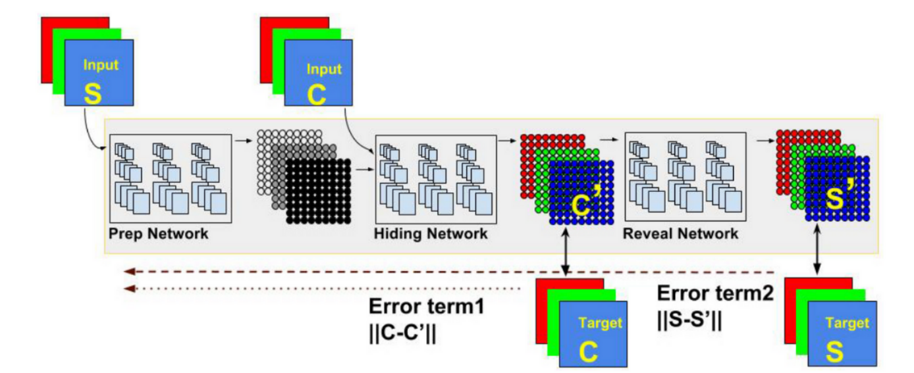
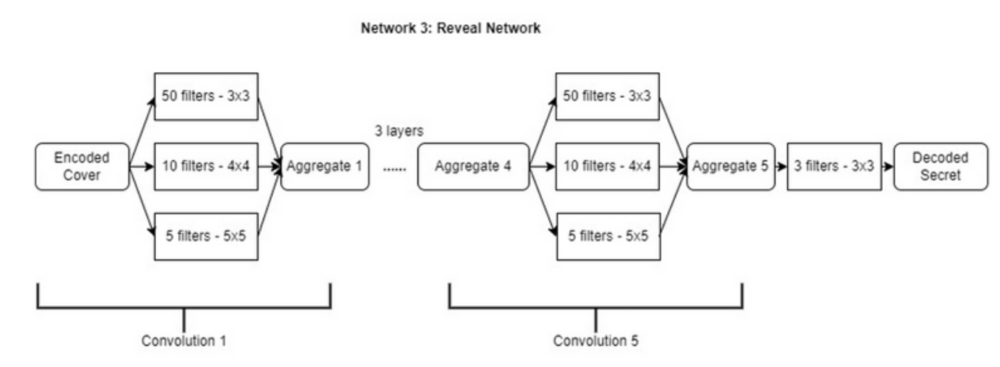
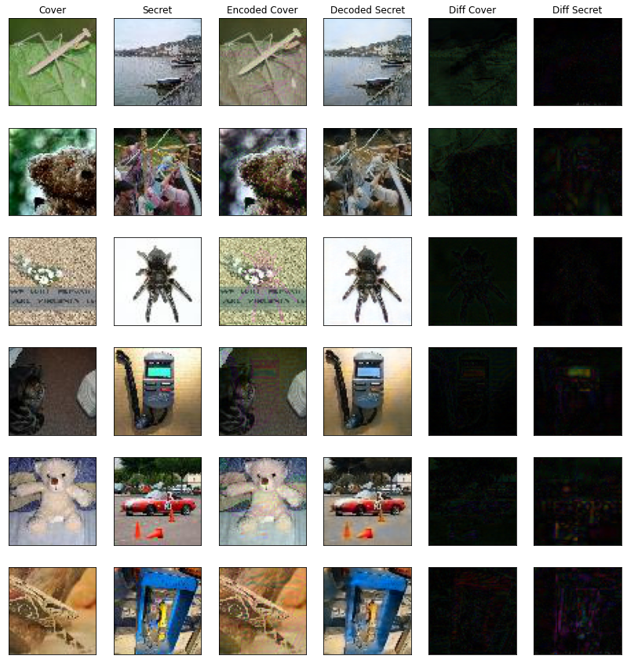
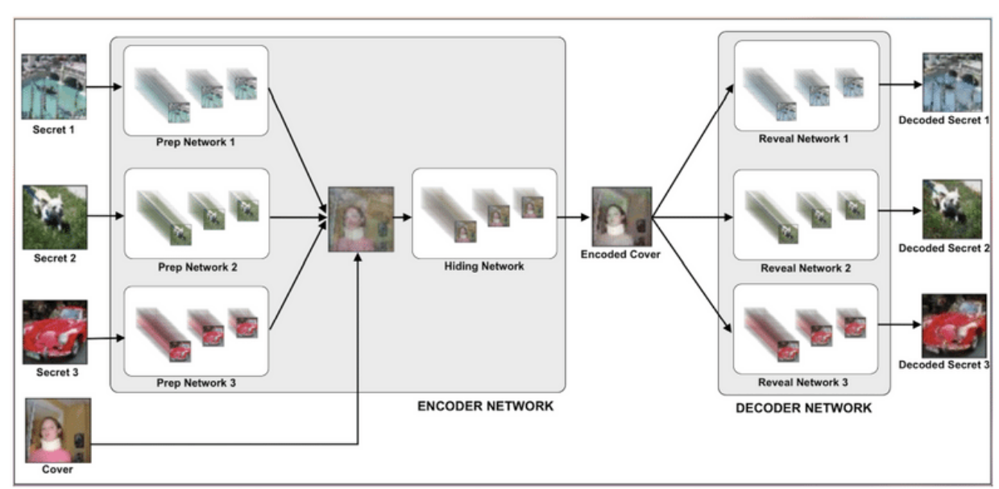
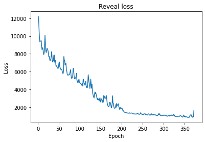
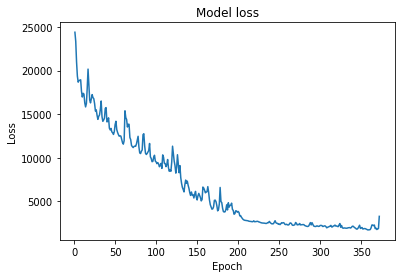
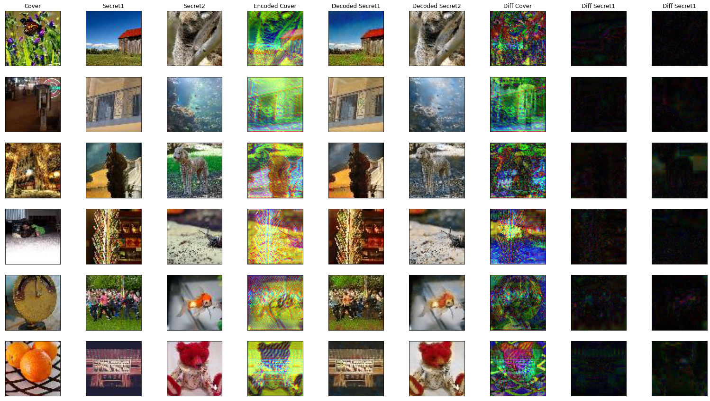

# Image Steganography

## Introduction

This is an implementation of the paper **Hiding Images in Plain Sight: Deep Steganography, by Shumeet Baluja (Google), at NIPS 2017**. The paper is available [here](https://papers.nips.cc/paper/6802-hiding-images-in-plain-sight-deep-steganography).

## Dataset

The Dataset used is Tiny ImageNet Visual Recognition Challenge. It can be downloaded [here](https://drive.google.com/drive/folders/1R9nEM3cBXgYbnG_LBmASNvgthtSfaF8_?usp=sharing).

Our training set is made of a random subset of images from all 200 classes.

We have used 600 images and splitted them equally between Secret set and Cover set.

### Visual Representation of Tiny Imagenet Images

## Model

The model is composed of three parts: The **Preparation Network**, **Hiding Network** (Encoder) and the **Reveal Network**. Its goal is to be able to encode information about the secret image S into the cover image C, generating C' that closely resembles C, while still being able to decode information from C' to generate the decoded secret image S', which should resemble S as closely as possible.

### Preparation Network

Prep-Network prepares the secret image to be hidden. This component serves two purposes. First, in cases in which the secret-image (size M × M) is smaller than the cover image (N × N), the preparation network progressively increases the size of the secret image to the size of the cover, thereby distributing the secret image’s bits across the entire N × N pixels. It is consisted of 2 convolution layers of 65 filters {50 3 × 3, 10 4 × 4, 5 5 × 5} patches.

### Hiding Network

Hiding Network, takes as input the output of the preparation-network and the cover image, and creates the Container image. The input to this network is a N × N pixel
field, with depth concatenated RGB channels of the cover image and the transformed channels of the secret image. It is consisted of 5 convolution layers of 65 filters {50 3 × 3, 10 4 × 4, 5 5 × 5} patches.

### Reveal Network

Reveal Network, is used by the receiver of the image; it is the decoder. It receives only the Container image (not the
cover nor secret image). The decoder network removes the cover image to reveal the secret image.

### Model Parameters

- Optimizer : Adam
- Decoder Loss Functions: ||S-S'||
- Auto-encoder Loss Function: ||C-C'|| + ||S-S'||
- #Epochs: 1000
- Batch Size: 32

## Results

### Decoder Loss

Decoder Loss aka reveal loss : L2 Norm of input-secret and decoder-secret image.

### Auto-Encoder Loss

Auto-Encoder Loss aka Model loss : Decoder loss + L2 norm of input-cover image and encoded-cover image.

### Overall Difference between images

## Multi Image Steganography

Going beyond hiding image in image, we implemented hiding of 2 secret images in one cover image.

## Dataset

600 tiny images are equally divided in 3 sets of secret and cover images. 

Secret 1 set : 200 images
Secret 2 set : 200 images
Cover set : 200 images

## Model

Model architecture is similar to hiding single image in an image. The only difference is multiple preparation networks and reveal networks.

### Model Parameters

- Optimizer : Adam
- Decoder Loss Functions: ||S-S'||
- Auto-encoder Loss Function: ||C-C'|| + ||S-S'||
- #Epochs: 1000
- Batch Size: 32

## Results

Average of all reveal networks loss vs epoch

## References

- [Hiding Images in Plain Sight: Deep Steganography, by Shumeet Baluja (Google), at NIPS 2017](https://papers.nips.cc/paper/6802-hiding-images-in-plain-sight-deep-steganography)
- [Image Steganography by Alexandre](https://github.com/alexandremuzio/deep-steg)
- [Multi-Image Steganography Using Deep Neural Networks](https://arxiv.org/abs/2101.00350)